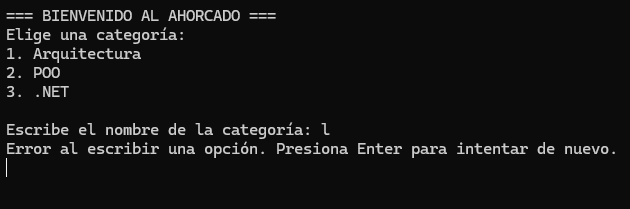

# 🔤 Juego de Ahorcado - Consola C#

## 📖 Descripción
Este proyecto es una implementación clásica del juego del Ahorcado para la consola, donde el jugador debe adivinar una palabra secreta oculta antes de quedarse sin intentos. El proyecto destaca por tener un diseño refactorizado y limpio que facilita la escalabilidad y el mantenimiento del código.

## 🛠️ Cómo se construyó
* **Lenguaje:** C# (Aplicación de consola).
* **Arquitectura:** Programación Orientada a Objetos (POO).
* **Patrones y Principios:** Se aplicaron los principios SOLID, destacando la **Inversión de Dependencias (DIP)**. El motor del juego (`MotorAhorcado`) es independiente de la interfaz de usuario (`ConsolaUI`) y de la fuente de datos. Las palabras se inyectan a través de la interfaz `IRepositorioPalabras`, lo que permite cambiar el origen de los datos (memoria, base de datos, texto) sin modificar la lógica del juego.

## ✨ Funcionalidades implementadas
* **Menú de Categorías:** El jugador puede elegir entre categorías técnicas (Arquitectura, POO, .NET) antes de iniciar.
* **Validación robusta:** El sistema atrapa entradas vacías o incorrectas y guía al usuario sin romper la ejecución del programa.
* **Interfaz visual:** Representación en texto del estado del ahorcado, letras usadas e intentos restantes.
* **Ciclo de juego continuo:** Opción de jugar múltiples partidas consecutivas instanciando objetos nuevos para reiniciar el estado de forma limpia.

## 🖼️ Capturas

**Menú**

 **Si escribes mal debes presionar 'Enter' para volver a escribir la categoria**

**Jugando**

**Perdiendo**

## 🤖 Declaración de uso de IA
Para el desarrollo de este proyecto, se utilizaron herramientas de Inteligencia Artificial de manera estrictamente ética, con fines educativos y de apoyo técnico. El uso de la IA se enfocó en:
* Resolución y comprensión de errores de compilación y de sintaxis.
* Orientación en la refactorización de código para el cumplimiento de los principios SOLID.
* Explicación del comportamiento del ciclo de vida de los objetos en C#.
Toda la lógica final, el flujo del programa, y la integración de los componentes fueron revisados, comprendidos y estructurados por mi (Astrit).

## 📄 Derechos de autor y Licencia
Este proyecto es de código abierto (Open Source) y se distribuye bajo la Licencia MIT. 

**¿Qué significa esto?**
¡Que cualquier persona es totalmente libre de usar este código! Puedes descargarlo, estudiarlo, modificarlo, compartirlo e incluso usarlo como base para tus propios proyectos escolares o personales sin ningún problema. 

El código se comparte con el propósito de aprender en comunidad. Lo único que pide la licencia es que si lo usas, se mantenga el crédito a la autora original. ¡Siéntete libre de explorarlo y darle un buen uso!

## 🤝 Agradecimientos

- **Profesor Jorge Javier Pedrozo Romero** por el apoyo constante.

---

## 📧 Contacto

- **Email Institucional:** [astrit.cetzal@tecdesoftware.edu.mx]
- **GitHub:** [astritcetzal](https://github.com/astritcetzal)

---

**⭐ Si te gustó este proyecto, dale una estrella ⭐**

Hecho con 💗 por [**Astrit Cetzal**] - 2026

