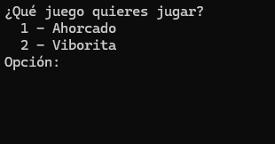
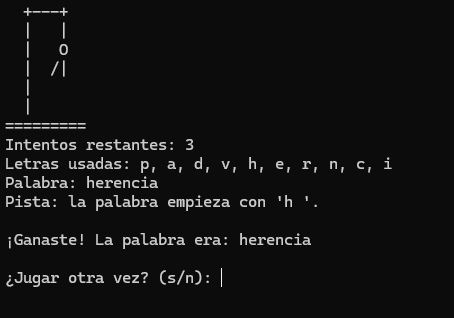
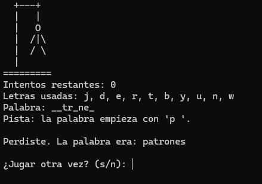

# #VIBORITA
# 🐍 Juego de Viborita (Snake) - Consola C#

## 📖 Descripción
Este proyecto es una recreación del clásico juego de la "Viborita" (Snake) que se ejecuta directamente en la consola. El jugador controla a la serpiente para comer alimentos (`*`), lo que la hace crecer y sumar puntos. El juego termina si la serpiente choca contra los bordes del tablero o contra su propio cuerpo. ¡El objetivo es llegar a los 10 puntos para ganar!

## 🛠️ Cómo se construyó
* **Lenguaje:** C# (Aplicación de consola).
* **Estructuras de datos:** Se utilizó una lista doblemente enlazada (`LinkedList`) para gestionar eficientemente el cuerpo de la serpiente, permitiendo agregar una nueva "cabeza" y eliminar la "cola" en cada movimiento sin reubicar todos los elementos en memoria.
* **Manejo de hilos e inputs:** Se implementó `Thread.Sleep` para controlar la velocidad del bucle principal del juego y `Console.KeyAvailable` para leer las teclas del usuario en tiempo real sin pausar la ejecución.
* **Interfaces:** La clase principal implementa la interfaz `IMotorJuego`, estandarizando los métodos de victoria y derrota.

## ✨ Funcionalidades implementadas
* **Renderizado en tiempo real:** Dibuja el tablero, la comida y el cuerpo de la serpiente frame por frame usando coordenadas `(x, y)` mediante `Console.SetCursorPosition`.
* **Detección de colisiones:** Lógica matemática para evitar que la serpiente atraviese las paredes o se muerda a sí misma.
* **Generación aleatoria segura:** La comida aparece en lugares aleatorios del tablero, validando mediante `LINQ` que no se genere encima del cuerpo actual de la serpiente.
* **Controles responsivos:** Cambio de dirección fluido usando las flechas del teclado, bloqueando movimientos imposibles (como ir hacia atrás sobre sí misma).

## 🖼️ Capturas

**Menú**

### Puedes elegir entre los juegos disponibles, en este caso la Viborita y el ahorcado. 

**Jugando Viborita**

**Perdiendo en Viborita**

## 🤖 Declaración de uso de IA
En el desarrollo de este proyecto, se utilizaron herramientas de Inteligencia Artificial (asistente) de manera ética, con fines educativos y de apoyo técnico. El uso de la IA se enfocó en:
* Resolución de errores de compilación y ajustes de visibilidad de clases (modificadores de acceso `public`/`internal`).
* Corrección de formato y anidamiento de bloques de código y comentarios.
* Integración del flujo de la Viborita junto con otros juegos en un menú principal unificado.
El flujo del programa, y la integración de los componentes fueron revisados, comprendidos y estructurados por mi (Astrit Cetzal).

## 📄 Derechos de autor y Licencia
Este proyecto es de código abierto (Open Source) y se distribuye bajo la Licencia MIT. 

**¿Qué significa esto?**
Que cualquier persona es totalmente libre de usar este código. Puedes descargarlo, estudiarlo, modificarlo, compartirlo e incluso usarlo como base para tus propios proyectos escolares o personales sin ningún problema. 

El código se comparte con el propósito de aprender en comunidad. Lo único que pide la licencia es que si lo usas, se mantenga el crédito a la autora original. ¡Siéntete libre de explorarlo y darle un buen uso!

## 🤝 Agradecimientos

- **Profesor Jorge Javier Pedrozo Romero** por el apoyo constante.

---

## 📧 Contacto

- **Email Institucional:** [astrit.cetzal@tecdesoftware.edu.mx]
- **GitHub:** [astritcetzal](https://github.com/astritcetzal)

---

**⭐ Si te gustó este proyecto, dale una estrella ⭐**

Hecho con 💗 por [**Astrit Cetzal**] - 2026

